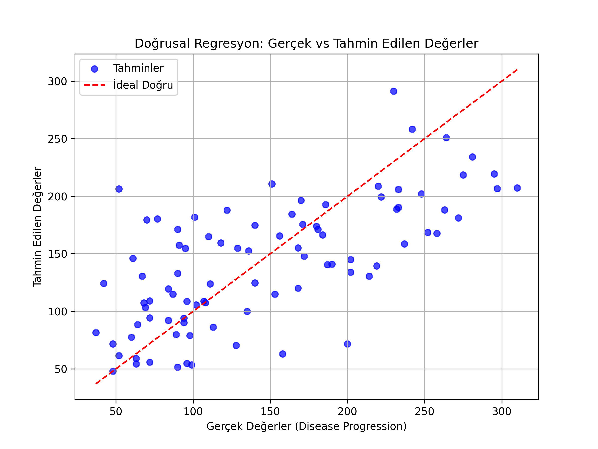

Bu döküman, projenin matematiksel altyapısını, kullanılan veri kümesini, çalıştırma adımlarını ve metriklerin ne anlama geldiğini açıklar.
code
Markdown
# 01 - Linear Regression (Doğrusal Regresyon)

Bu çalışma, doğrusal regresyon algoritmasının temellerini anlamak ve uygulamalı olarak test etmek amacıyla hazırlanmıştır. Projede hedef değişken olarak diyabet hastalığının bir yıl sonraki ilerleme düzeyi tahmin edilmeye çalışılmaktadır.

## Matematiksel Arka Plan

Doğrusal regresyon, bağımsız değişkenler ($X$) ile bağımlı sürekli değişken ($Y$) arasındaki doğrusal ilişkiyi modellemek için kullanılır. Çoklu doğrusal regresyon formülü şu şekildedir:

$$Y = \beta_0 + \beta_1 X_1 + \beta_2 X_2 + \dots + \beta_n X_n + \epsilon$$

Burada:
- $Y$: Tahmin edilmek istenen bağımlı değişken (Target)
- $X_i$: Bağımsız girdi öznitelikleri (Features)
- $\beta_0$: Kesişim noktası (Intercept)
- $\beta_i$: Özniteliklerin katsayıları (Coefficients / Ağırlıklar)
- $\epsilon$: Rassal hata terimi (Error Term)

Model, gerçek değerler ile tahmin edilen değerler arasındaki hata kareler toplamını (Residual Sum of Squares - RSS) en aza indirmeyi (Ordinary Least Squares - OLS) amaçlar.

---

## Veri Kümesi Bilgisi (Diabetes Dataset)

Çalışmada, `scikit-learn` kütüphanesinde hazır olarak sunulan **Diabetes Dataset** kullanılmıştır.
- **Örnek Sayısı:** 442
- **Öznitelik Sayısı:** 10 (Yaş, cinsiyet, BMI, ortalama kan basıncı ve 6 farklı kan serumu ölçümü)
- **Hedef Değişken:** Hastalığın başlangıç ölçümünden bir yıl sonraki ilerleme düzeyini temsil eden sürekli bir skor (25 - 346 aralığında değerler alır).

*Not: Veri kümesindeki 10 özniteliğin tamamı, analiz kolaylığı ve model kararlılığı için önceden ortalanmış ve standart sapmalarına göre ölçeklendirilmiştir.*

---
## Görsel Sonuç
`actual_vs_predicted.png` grafiğinde, mavi noktaların kırmızı kesikli ideal doğruya ne kadar yakın kümelendiğini inceleyerek modelin performansını görsel olarak analiz edebilirsiniz.



---
## Dosya Yapısı

```text
01-linear-regression/
├── README.md                     # Çalışma dökümantasyonu
├── requirements.txt              # Bu klasöre özel kütüphaneler
├── linear_regression_diabetes.py # Regresyon model kodu
└── actual_vs_predicted.png       # Gerçek vs Tahmin görselleştirme grafiği