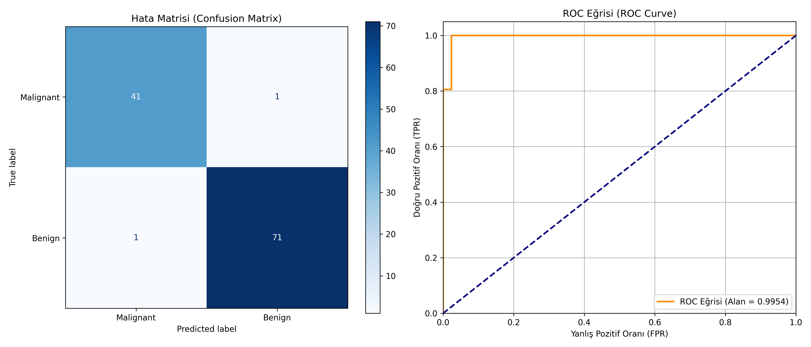

# 02 - Logistic Regression (Lojistik Regresyon)

Bu çalışma, sınıflandırma problemlerinde en temel ve güçlü algoritmalardan biri olan Lojistik Regresyon modelini anlamak ve uygulamak amacıyla hazırlanmıştır. Projede, göğüs kanseri biyopsi verileri kullanılarak tümörlerin iyi huylu (benign) ya da kötü huylu (malignant) olup olmadığı tahmin edilmektedir.

## Matematiksel Arka Plan

Lojistik Regresyon, girdi özniteliklerinin doğrusal kombinasyonunu alarak çıktıyı olasılıksal bir değere dönüştürmek için **Sigmoid (Lojistik) fonksiyonunu** kullanır. 

Sigmoid fonksiyonu formülü:

$$S(z) = \frac{1}{1 + e^{-z}}$$

Doğrusal bileşen ($z$) Sigmoid içine yerleştirildiğinde model şu formu alır:

$$P(Y=1|X) = \frac{1}{1 + e^{-(\beta_0 + \beta_1 X_1 + \dots + \beta_n X_n)}}$$

Elde edilen değer $0$ ile $1$ arasında bir olasılık değeridir. Genellikle $0.5$ eşik değeri (threshold) kabul edilerek olasılık $0.5$'ten büyükse sınıf $1$ (Benign), küçükse sınıf $0$ (Malignant) olarak tahmin edilir.

---

## Veri Kümesi Bilgisi (Breast Cancer Wisconsin)

Çalışmada, `scikit-learn` kütüphanesinde hazır olarak sunulan **Breast Cancer Wisconsin Dataset** kullanılmıştır.
- **Örnek Sayısı:** 569 (212 Malignant, 357 Benign)
- **Öznitelik Sayısı:** 30 (Hücre çekirdeğine ait yarıçap, doku pürüzsüzlüğü, çevre uzunluğu, alan vb. istatistikler)
- **Hedef Değişken (Target):** İkili sınıflandırma (0: Malignant, 1: Benign)

---

## Neden Ölçeklendirme (Feature Scaling) Yaptık?

Lojistik Regresyon, optimizasyon esnasında kayıp fonksiyonunun gradyanını kullanır. Özniteliklerin farklı ölçeklerde olması (örneğin alan değeri $1000$ iken pürüzsüzlük değerinin $0.1$ olması), modelin parametreleri yanlış ağırlıklandırmasına ve eğitim süresinin çok uzamasına yol açar. Bu nedenle girdiler, ortalaması $0$ ve standart sapması $1$ olacak şekilde standartlaştırılmıştır.

---
## Görsel Sonuç
Betik çalıştıktan sonra kaydedilen `logistic_regression_metrics.png` dosyasında, modelin yanlış tahmin oranlarını (hata matrisinde köşegen dışı elemanlar) ve ROC-AUC alanının büyüklüğünü görsel olarak analiz edebilirsiniz.


---

## Dosya Yapısı

```text
02-logistic-regression/
├── README.md                           # Çalışma dökümantasyonu
├── requirements.txt                    # Bu klasöre özel kütüphaneler
├── logistic_regression_breast_cancer.py# Lojistik Regresyon model kodu
└── logistic_regression_metrics.png     # Hata Matrisi ve ROC grafiği