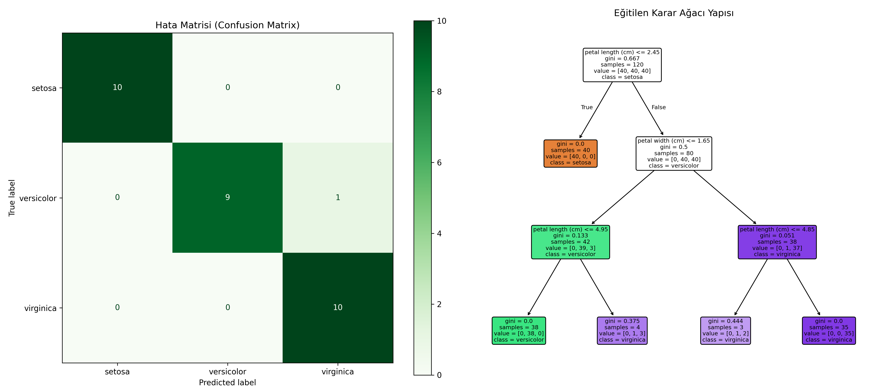

# 03 - Decision Tree (Karar Ağaçları)

Bu çalışma, makine öğrenmesinde hem sınıflandırma hem de regresyon için kullanılan, kararların şeffaf şekilde izlenebildiği (white-box) Karar Ağacı algoritmasını uygulamak amacıyla hazırlanmıştır. Projede Iris çiçek veri seti kullanılarak üç farklı türün sınıflandırılması gerçekleştirilmiştir.

## Matematiksel Arka Plan ve Bölme Kriterleri

Karar Ağaçları, veriyi en saf alt kümelere ayırmak için her adımda en bilgilendirici özniteliği seçmeye çalışır. En sık kullanılan iki bölme (splitting) kriteri vardır:

### 1. Gini Safsızlığı (Gini Impurity)
Bir kümenin ne kadar karışık olduğunu ölçer. Tamamen saf bir kümenin Gini değeri $0$ olur.
$$Gini = 1 - \sum_{i=1}^{C} (p_i)^2$$
*Burada $p_i$, ilgili düğümdeki $i$ sınıfına ait örneklerin oranıdır.*

### 2. Entropi (Entropy / Information Gain)
Bilgi teorisinden gelen düzensizlik ölçüsüdür.
$$Entropy = -\sum_{i=1}^{C} p_i \log_2(p_i)$$

Model, her düğümde bu değerleri en çok düşürecek (Information Gain'i en çok artıracak) eşik değerleri ($X_i < \text{eşik}$) arar ve dallanmayı gerçekleştirir.

---

## Karar Ağaçlarının Avantajları ve Dezavantajları

- **Avantajı (Ölçeklendirme Gerekmez):** Karar Ağaçları sadece eşik değerleri aradığı için verinin ölçeğinden etkilenmez. Dolayısıyla `StandardScaler` veya `MinMaxScaler` uygulamak model performansını değiştirmez.
- **Dezavantajı (Overfitting Eğilimi):** Ağaç serbest bırakıldığında (büyümesine sınır konmadığında) her bir yaprağa tek bir örnek kalana kadar dallanabilir. Bu durum eğitim verisini ezberlemesine (aşırı öğrenme) yol açar. Bunu engellemek için `max_depth` (maksimum derinlik) veya `min_samples_split` gibi hiperparametrelerle ağaç budanmalıdır (pruning).

---

## Veri Kümesi Bilgisi (Iris Dataset)

Çalışmada klasik **Iris Flower Dataset** kullanılmıştır.
- **Örnek Sayısı:** 150
- **Öznitelik Sayısı:** 4 (Çanak yaprak uzunluğu/genişliği, taç yaprak uzunluğu/genişliği)
- **Hedef Değişken (Sınıflar):** 3 Sınıf (Setosa, Versicolor, Virginica)

---
## Görsel Sonuç
Betik çalıştırıldıktan sonra kaydedilen `decision_tree_structure.png` görselinin sağ tarafında eğitilen ağacın bir şemasını göreceksiniz. Şemadaki her bir kutuda şunlar yer alır:


---

## Dosya Yapısı

```text
03-decision-tree/
├── README.md                      # Çalışma dökümantasyonu
├── requirements.txt               # Bu klasöre özel kütüphaneler
├── decision_tree_iris.py          # Karar ağacı model kodu
└── decision_tree_structure.png    # Hata matrisi ve çizilen ağaç şeması