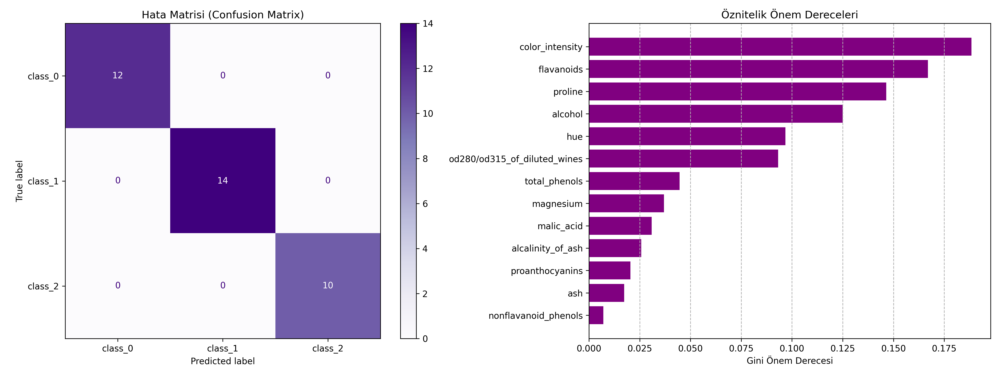

# 04 - Random Forest (Rastgele Orman)

Bu çalışma, makine öğrenmesinde en popüler topluluk (ensemble) öğrenme yöntemlerinden biri olan Rastgele Orman (Random Forest) algoritmasını incelemek amacıyla hazırlanmıştır. Projede Wine veri kümesi kullanılarak, kimyasal bileşenlerine göre şarap sınıflarının tahmin edilmesi amaçlanmaktadır.

## Matematiksel ve Teorik Arka Plan

Rastgele Orman, tekil karar ağaçlarının yüksek varyans (overfitting) eğilimini azaltmak için **Bagging (Bootstrap Aggregating)** ve **Öznitelik Alt Uzay (Feature Bagging)** yöntemlerini birleştiren bir topluluk modelidir.

### 1. Bootstrap Örneklemesi (Bagging)
Eğitim setinden yerine koyarak (with replacement) rastgele alt veri kümeleri ($D_1, D_2, \dots, D_T$) çekilir. Her bir alt küme üzerinde birbirinden bağımsız bir karar ağacı eğitilir.

### 2. Rastgele Öznitelik Seçimi (Feature Bagging)
Her bir düğümde en iyi bölünme aranırken tüm öznitelikler incelenmek yerine, toplam $M$ adet öznitelikten rastgele seçilen daha küçük bir grup ($m \approx \sqrt{M}$) değerlendirilir. Bu, ağaçların birbirine çok benzemesini (correlation) engeller ve çeşitliliği (diversity) artırır.

### 3. Çoğunluk Oylaması (Voting / Aggregation)
Sınıflandırma problemlerinde, nihai tahmin tüm ağaçların verdiği kararların çoğunluk oylaması (majority vote) ile belirlenir:

$$\hat{Y} = \text{mod} \{ T_1(X), T_2(X), \dots, T_B(X) \}$$

---

## Neden Karar Ağaçlarına Tercih Edilir?

- **Düşük Varyans:** Tek bir karar ağacı derinleştikçe gürültüyü ezberleyebilir (aşırı öğrenir). Rastgele Orman, birçok ağacın tahminini ortalayarak varyansı düşürür ancak yanlılığı (bias) artırmaz.
- **Kararlılık (Out-of-Bag - OOB):** Bootstrap sırasında verilerin yaklaşık %36.8'i eğitimde kullanılmaz (Out-of-Bag). Bu veri, test kümesine benzer şekilde modeli doğrulamak için kullanılabilir.

---

## Veri Kümesi Bilgisi (Wine Recognition Dataset)

Çalışmada, `scikit-learn` kütüphanesinde hazır olarak sunulan **Wine Recognition Dataset** kullanılmıştır.
- **Örnek Sayısı:** 178
- **Öznitelik Sayısı:** 13 (Alkol oranı, malik asit düzeyi, kül miktarı, magnezyum düzeyi, renk yoğunluğu vb.)
- **Hedef Değişken (Sınıf):** 3 Sınıf (class_0, class_1, class_2)

---
## Görsel Sonuç
Betik çalıştırıldıktan sonra kaydedilen `random_forest_results.png` görselinin sağ tarafında yer alan **Öznitelik Önem Dereceleri (Feature Importances)** grafiğini inceleyebilirsiniz:


---

## Dosya Yapısı

```text
04-random-forest/
├── README.md                      # Çalışma dökümantasyonu
├── requirements.txt               # Bu klasöre özel kütüphaneler
├── random_forest_wine.py          # Rastgele Orman model kodu
└── random_forest_results.png      # Hata matrisi ve öznitelik önem grafiği