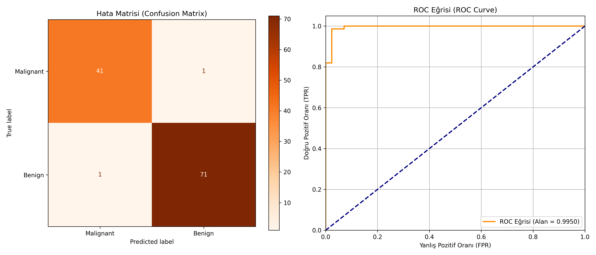

# 05 - Support Vector Machines (Destek Vektör Makineleri)

Bu çalışma, doğrusal ve doğrusal olmayan verilerin sınıflandırılmasında en kararlı çalışan optimizasyon tabanlı algoritmalardan biri olan Destek Vektör Makinelerini (SVM) uygulamak amacıyla hazırlanmıştır. Projede göğüs kanseri biyopsi verileri kullanılarak sınıflandırma yapılmıştır.

## Matematiksel ve Teorik Arka Plan

SVM'in temel amacı, iki sınıfı birbirinden ayıran ve sınıfların en yakın örneklerine (Destek Vektörleri) en uzak mesafede olan **optimum karar hiperdüzlemini (hyperplane)** bulmaktır.

### 1. Marj (Margin) Maksimizasyonu
Karar düzlemi ile en yakın örnekler arasındaki mesafeye **Marj (Margin)** denir. Amaç, marjı maksimize eden ağırlık vektörünü ($w$) bulmaktır:

$$\min_{w, b} \frac{1}{2} \|w\|^2 \quad \text{subject to} \quad y_i(w^T x_i + b) \geq 1$$

### 2. Ceza Parametresi ($C$)
Gerçek dünya verilerinde sınıflar kusursuz bir şekilde ayrılamayabilir (soft margin). $C$ parametresi, eğitim hataları ile marj genişliği arasındaki dengeyi belirler:
- **Düşük $C$ (Yumuşak Marj):** Eğitim hatalarına daha toleranslı yaklaşır, daha geniş marj arar. Aşırı öğrenmeyi (overfitting) engelleyebilir.
- **Yüksek $C$ (Sert Marj):** Eğitim hatasını sıfıra indirmeye çalışır, marjı daraltır. Aşırı öğrenmeye yol açabilir.

### 3. Çekirdek Hilesi (Kernel Trick) ve RBF
Doğrusal olarak ayrılamayan veriler, matematiksel dönüşüm fonksiyonları (kernels) ile daha yüksek boyutlu bir uzaya taşınır. Bu sayede o boyutta doğrusal bir şekilde ayrılabilir hale gelirler. En popüler çekirdek **Radyal Tabanlı Fonksiyon (RBF)** çekirdeğidir:

$$K(x_i, x_j) = \exp(-\gamma \|x_i - x_j\|^2)$$

*$\gamma$ (gamma) parametresi, tek bir eğitim örneğinin etki alanını belirler. Büyük gama dar etki alanına (overfit riski), küçük gama ise geniş etki alanına yol açar.*

---

## Neden Özellik Ölçeklendirme (Feature Scaling) Zorunludur?

SVM, sınıflar arası mesafeyi (genellikle Öklid mesafesi) doğrudan hesaplayan geometrik bir algoritmadır. 
Örneğin, özniteliklerden birinin aralığı $[0.01, 0.1]$ iken diğerinin aralığı $[1000, 5000]$ ise, mesafe formülünde büyük olan değer tüm karar yapısını domine eder. Bu durum modelin başarısız olmasına yol açar. Bu yüzden girdi verilerine standardizasyon (`StandardScaler`) uygulamak **kesinlikle zorunludur**.

---
## Görsel Sonuç
Betik çalıştıktan sonra kaydedilen `svm_results.png` dosyasında, modelin yanlış tahmin oranlarını (hata matrisinde köşegen dışı elemanlar) ve ROC-AUC alanının büyüklüğünü görsel olarak analiz edebilirsiniz.


---

## Dosya Yapısı

```text
05-svm/
├── README.md                           # Çalışma dökümantasyonu
├── requirements.txt                    # Bu klasöre özel kütüphaneler
├── svm_classifier_breast_cancer.py     # SVM sınıflandırma kodu
└── svm_results.png                     # Hata matrisi ve ROC grafiği