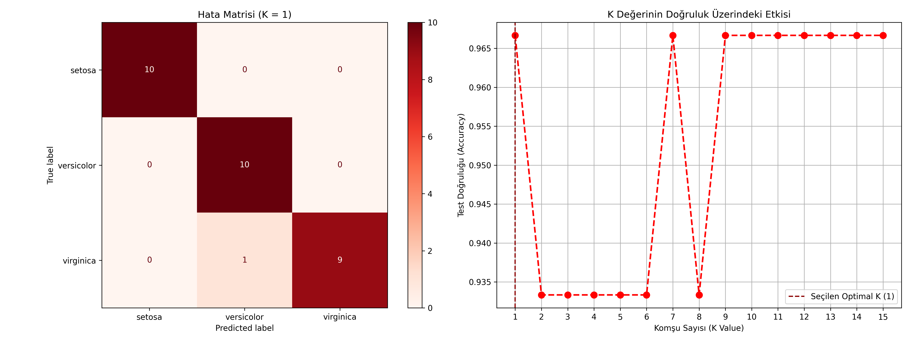

# 06 - K-Nearest Neighbors (K-En Yakın Komşu)

Bu çalışma, makine öğrenmesinin en sezgisel ve anlaşılır mesafe tabanlı sınıflandırma algoritmalarından biri olan K-En Yakın Komşu (KNN) modelini uygulamak amacıyla hazırlanmıştır. Projede Iris çiçek verileri kullanılarak çoklu sınıflandırma ve en uygun komşu parametresinin ($K$) tespiti analiz edilmiştir.

## Matematiksel ve Teorik Arka Plan

KNN, parametrik olmayan bir algoritmadır; yani verinin belirli bir dağılımdan geldiğini varsaymaz. Sınıflandırma kararını, tahmin edilmek istenen yeni veri noktasına en yakın olan $K$ adet eğitim örneğinin sınıflarına bakarak çoğunluk oylaması yöntemiyle verir.

### 1. Mesafe Metrikleri (Minkowski & Euclidean)
Örnekler arasındaki yakınlığı ölçmek için genellikle **Minkowski** mesafesi temel alınır:

$$D(x, y) = \left( \sum_{i=1}^{n} |x_i - y_i|^p \right)^{1/p}$$

- $p=2$ seçildiğinde **Öklid (Euclidean) Mesafesi** elde edilir (En yaygın kullanım):
  $$D_{Euclidean} = \sqrt{\sum_{i=1}^{n} (x_i - y_i)^2}$$
- $p=1$ seçildiğinde **Manhattan Mesafesi** elde edilir:
  $$D_{Manhattan} = \sum_{i=1}^{n} |x_i - y_i|$$

### 2. $K$ Parametresinin Seçimi (Yanlılık - Varyans Dengesi)
Komşuluk sayısı $K$, modelin karmaşıklığını doğrudan kontrol eder:
- **Düşük $K$ (Örn: $K=1$):** Karar sınırları çok keskindir. Gürültüden (noise) çok kolay etkilenir. Model aşırı öğrenmeye (overfitting) eğilimlidir (Düşük Yanlılık, Yüksek Varyans).
- **Yüksek $K$ (Örn: $K=50$):** Karar sınırları pürüzsüzleşir. Sınıf dağılımını çok fazla geneller ve detayları kaçırır (Yüksek Yanlılık, Düşük Varyans).

---

## Neden "Tembel Öğrenici" (Lazy Learner) Olarak Adlandırılır?

KNN, klasik modeller gibi eğitim aşamasında bir matematiksel formül, katsayı tablosu veya karar ağacı yapısı **oluşturmaz**. 
- Eğitim aşamasında sadece tüm eğitim verisini bellekte saklar.
- Asıl hesaplama (tüm veri noktalarına olan mesafelerin tek tek bulunması ve sıralanması) tahmin aşamasında gerçekleşir.
- Bu nedenle eğitim süresi sıfırken, büyük veri setlerinde tahmin yapma süresi oldukça uzundur.

---

## Neden Özellik Ölçeklendirme (Feature Scaling) Kesinlikle Zorunludur?

Algoritmanın kalbi mesafe hesaplamasıdır. Eğer özniteliklerin ölçüm birimleri ve sayısal aralıkları birbirinden farklıysa (örneğin milimetre ölçekli bir değişken ile metre ölçekli bir değişken yan yanaysa), büyük değerlere sahip değişken mesafeyi tamamen kendi lehine büker. Komşular yanlış seçilir. Bu nedenle veriye `StandardScaler` uygulamak **şarttır**.

---
## Görsel Sonuç
Betik çalıştırıldıktan sonra kaydedilen `knn_results.png` görselinde şunları analiz edebilirsiniz:


---

## Dosya Yapısı

```text
06-knn/
├── README.md                      # Çalışma dökümantasyonu
├── requirements.txt               # Bu klasöre özel kütüphaneler
├── knn_classifier_iris.py         # KNN sınıflandırma kodu
└── knn_results.png                # Hata matrisi ve K-Doğruluk grafiği