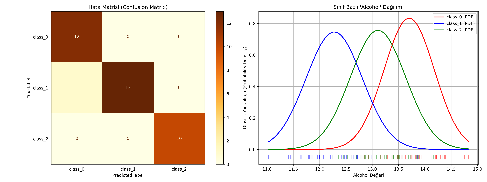

# 07 - Naive Bayes (Saf Bayes Sınıflandırıcısı)

Bu çalışma, olasılıksal yaklaşımın en popüler sınıflandırma modellerinden biri olan Naive Bayes algoritmasını uygulamak amacıyla hazırlanmıştır. Projede Wine veri kümesindeki sürekli değişkenler üzerinden şarap sınıfları tahmin edilmektedir.

## Matematiksel ve Teorik Arka Plan

Naive Bayes, olasılık tabanlı bir sınıflandırıcıdır ve temelini **Bayes Teoremi** oluşturur:

$$P(C_k | x) = \frac{P(x | C_k) P(C_k)}{P(x)}$$

Burada:
- $P(C_k | x)$: Sonsal Olasılık (Posterior Probability) - Verilen $x$ öznitelik vektörüne göre örneğin $C_k$ sınıfına ait olma olasılığı.
- $P(x | C_k)$: Olabilirlik (Likelihood) - $C_k$ sınıfındaki örneklerin $x$ özniteliklerine sahip olma olasılığı.
- $P(C_k)$: Önsel Olasılık (Prior Probability) - Sistemdeki $C_k$ sınıfının genel bulunma olasılığı.
- $P(x)$: Kanıt Olasılığı (Evidence) - Verinin normalize edici sabiti.

### "Saf" (Naive) Varsayımı Nedir?
Algoritma, verideki tüm özniteliklerin sınıf bazında birbirinden **tamamen bağımsız (class-conditional independence)** olduğunu varsayar. Bu varsayım gerçek dünyada nadiren sağlansa da (örneğin bir şaraptaki alkol düzeyi ile magnezyum düzeyi ilişkili olabilir), bu sadeleştirme matematiksel formülü çarpım formuna getirerek hesaplama yükünü inanılmaz derecede hafifletir:

$$P(x | C_k) = P(x_1 | C_k) \times P(x_2 | C_k) \times \dots \times P(x_n | C_k) = \prod_{i=1}^{n} P(x_i | C_k)$$

### Gaussian Naive Bayes (Normal Dağılım Varsayımı)
Sürekli (continuous) sayısal verilerle çalışırken özniteliklerin olabilirlik olasılıklarını hesaplamak için her sınıf bazında özniteliklerin normal (Gaussian) dağılıma uyduğu varsayılır:

$$P(x_i | C_k) = \frac{1}{\sqrt{2\pi\sigma_k^2}} e^{-\frac{(x_i - \mu_k)^2}{2\sigma_k^2}}$$

- Burada $\mu_k$ ve $\sigma_k^2$, $C_k$ sınıfına ait eğitim örneklerinin ilgili öznitelik ortalaması ve varyansıdır.

---

## Naive Bayes Algoritmasının Avantajları ve Varyasyonları

- **Ölçeklendirme Bağımsızlığı:** Naive Bayes her özniteliği ayrı ayrı değerlendirir. Özniteliklerin farklı aralıklarda olması olasılık oranlarını etkilemez. Dolayısıyla özellik ölçeklendirme (`StandardScaler`) **gerekli değildir**.
- **Hız ve Yüksek Boyut Dayanıklılığı:** Karmaşık katsayı aramaları veya iteratif gradyan güncellemeleri yapmaz. Sadece basit frekans ve istatistik hesapladığı için eğitimi anlıktır. Özellikle metin sınıflandırma (Spam tespiti, duygu analizi) gibi çok yüksek boyutlu verilerde mükemmel çalışır.

### Popüler Naive Bayes Türleri:
1. **Gaussian NB:** Sürekli sayısal öznitelikler için (Bu projede kullanılan).
2. **Multinomial NB:** Metin sınıflandırmalarındaki kelime frekans sayımları için (ayrık sayılabilir veriler).
3. **Bernoulli NB:** İkili (Binary/Boolean) öznitelikler için (kelime var mı/yok mu durumu).

---

## Veri Kümesi Bilgisi (Wine Recognition Dataset)

Çalışmada, sürekli kimyasal ölçümler içeren **Wine Recognition Dataset** kullanılmıştır.
- **Örnek Sayısı:** 178
- **Öznitelik Sayısı:** 13 (Alkol oranı, kül, magnezyum düzeyi vb.)
- **Hedef Değişken (Sınıf):** 3 Sınıf (class_0, class_1, class_2)

---
## Görsel Sonuç
Betik çalıştırıldıktan sonra kaydedilen `naive_bayes_results.png` görselinin sağ tarafındaki grafikte:


---

## Dosya Yapısı

```text
07-naive-bayes/
├── README.md                      # Çalışma dökümantasyonu
├── requirements.txt               # Bu klasöre özel kütüphaneler
├── gaussian_naive_bayes_wine.py   # Naive Bayes model kodu
└── naive_bayes_results.png        # Hata matrisi ve normal dağılım grafiği