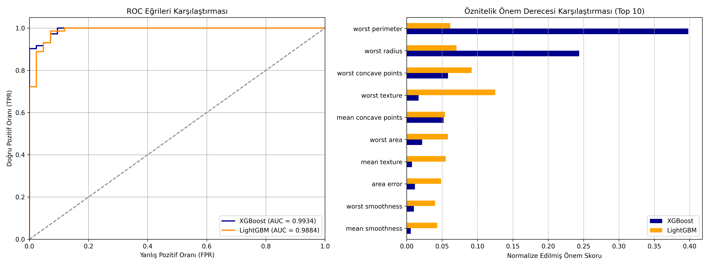

# 08 - Gradient Boosting: XGBoost vs LightGBM

Bu çalışma, tabular veri kümelerinde makine öğrenmesi dünyasının en güçlü sınıflandırma ve regresyon motorlarından olan **XGBoost (Extreme Gradient Boosting)** ve **LightGBM (Light Gradient Boosting Machine)** kütüphanelerini karşılaştırmalı olarak uygulamak amacıyla hazırlanmıştır. Projede Breast Cancer veri seti üzerinde iki modelin hız, performans ve öznitelik kararları karşılaştırılmaktadır.

---

## Teorik Arka Plan: Gradient Boosting Nedir?

Gradient Boosting, zayıf öğrenicileri (genellikle sığ karar ağaçları) sıralı (sequential) olarak bir araya getiren bir topluluk modelidir.
- İlk ağaç eğitildikten sonra, ikinci ağaç ilk ağacın yaptığı **hataları (rezidüleri - residuals)** tahmin etmek üzere eğitilir.
- Bu süreç, kayıp fonksiyonunun gradyanı (türevi) yönünde adım adım ilerleyerek (Gradient Descent benzeri bir yaklaşımla) hataların minimize edilmesini sağlar.

---

## XGBoost ve LightGBM Arasındaki Farklar

İki kütüphane de temelde Gradient Boosting Decision Tree (GBDT) kullansa da, ağaçları bölme ve veriyi işleme yöntemlerinde devrimsel farklar barındırırlar.

| Özellik | XGBoost | LightGBM |
| :--- | :--- | :--- |
| **Ağaç Büyüme Stratejisi** | **Level-wise** (Katman bazlı): Ağacı katman katman dengeli şekilde büyütür. | **Leaf-wise** (Yaprak bazlı): Kaybı en çok düşürecek olan yaprağı seçip derinlemesine büyütür. |
| **Bölünme Algoritması** | **Pre-sorted**: Öznitelikleri sıralayıp her bir bölünme noktasını tek tek dener (Hassas ama yavaştır). | **Histogram-based**: Sayısal değerleri belirli kovalara (bins) bölerek histogram oluşturur ve bölünmeyi oradan arar (Çok hızlıdır). |
| **Büyük Veriye Direnç** | Belleği (RAM) ve işlemciyi yoğun kullanır. | **GOSS** (Gradient-based One-Side Sampling) ve **EFB** (Exclusive Feature Bundling) algoritmalarıyla devasa verilerde minimal bellek tüketir ve son derece hızlıdır. |

### Ağaç Büyüme Görsel Karşılaştırması:
- **Level-wise (XGBoost):**
  ```text
       [Root]
       /    \
     [L1]  [L1]  <- Seviye dengeli büyütülür
     /  \  /  \

Not: Leaf-wise yaklaşımı küçük veri setlerinde aşırı öğrenmeye (overfitting) daha eğilimlidir. Bu nedenle max_depth parametresiyle ağaç derinliğini sınırlamak önemlidir.
---
## Görsel Sonuç
Betik çalıştırıldıktan sonra konsolda ve üretilen grafiklerde şunlar analiz edilmelidir:


---

## Dosya Yapısı
```text
08-lightgbm-xgboost/
├── README.md                           # Çalışma dökümantasyonu
├── requirements.txt                    # Bu klasöre özel kütüphaneler
├── gradient_boosting_comparison.py     # Karşılaştırmalı model kodu
└── boosting_comparison_results.png     # Karşılaştırmalı ROC ve Öznitelik Önem grafiği