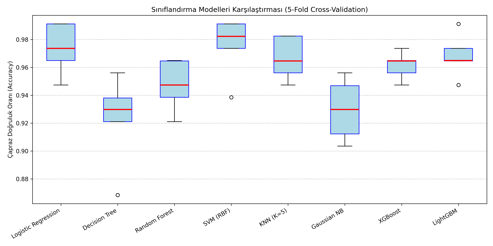

# 09 - Cross-Validation & Model Comparison (Model Karşılaştırma)

Bu çalışma, gözetimli makine öğrenmesinde sınıflandırma amacıyla kullanılan 8 farklı algoritmayı aynı veri kümesi ve eşit şartlar altında yarıştırmak amacıyla hazırlanmıştır. Modellerin başarısı, veri rastgeleliğinden kaynaklanabilecek sapmaları engellemek için **5-Katlı Çapraz Doğrulama (5-Fold Cross-Validation)** ile test edilmiştir.

---

## Neden Sadece Tren/Test Ayrımı (Train-Test Split) Yetmez?

Veriyi sadece bir kere %80 eğitim ve %20 test olarak ayırdığımızda, şans eseri test kümesine model için çok kolay veya çok zor tahmin edilebilecek örnekler düşebilir.
- Bu durum, modelin gerçek dünyadaki performansını yanıltıcı şekilde yüksek veya düşük gösterebilir (Varyans hatası).
- Çapraz doğrulama, bu rastgeleliği ortadan kaldırarak modelin **genellenebilirliğini (generalizability)** ölçer.

---

## Stratified $K$-Fold Çapraz Doğrulama Nedir?

Çapraz doğrulamada veri seti $K$ adet eşit parçaya (fold) bölünür. Her adımda $K-1$ parça eğitim için kullanılırken, kalan 1 parça test (doğrulama) için kullanılır. Bu işlem $K$ kez tekrarlanır ve her adımın skoru kaydedilir.

**Stratified (Tabakalı) $K$-Fold** ise sınıflandırma problemlerinde kritik bir role sahiptir:
- Sınıf dağılım oranlarını (örneğin %40 Malignant, %60 Benign) her bir katlamada (fold) orijinal veriyle birebir aynı oranda korur. 
- Bu sayede dengesiz veri kümelerinde modellerin haksız bir şekilde yüksek başarı göstermesi veya katlamalardan birine hiç pozitif sınıf düşmemesi gibi riskler engellenir.

---

## Yarışan Model Aileleri ve Özellikleri

Yarışma parkurunda 4 farklı algoritma ailesi yer almaktadır:
1. **Doğrusal Modeller:** `Logistic Regression` (İlişkileri doğrusal düzlemde arar).
2. **Mesafe ve Olasılık Tabanlılar:** `KNN` ve `Gaussian Naive Bayes` (Komşuluk mesafesi ve normal olasılık yoğunlukları).
3. **Optimizasyon Tabanlılar:** `SVM (RBF)` (Marj sınırlarını maksimize eder).
4. **Ağaç ve Topluluk (Ensemble) Modelleri:** `Decision Tree`, `Random Forest`, `XGBoost` ve `LightGBM` (Karar kuralları, bootstrap ağaçlar ve gradyan tabanlı sıralı hata azaltma).

---
## Görsel Sonuç
Betik çalıştırıldıktan sonra kaydedilen `model_comparison_results.png` dosyasında her model için bir kutu grafiği çizilir. Bu grafikler sadece ortalama başarıyı değil, modelin tutarlılığını da gösterir:


---

## Dosya Yapısı

```text
09-model-comparison/
├── README.md                           # Çalışma dökümantasyonu
├── requirements.txt                    # Bu klasöre özel kütüphaneler
├── cross_validation_comparison.py      # Çoklu model karşılaştırma kodu
└── model_comparison_results.png        # Modellerin varyans kutu grafiği