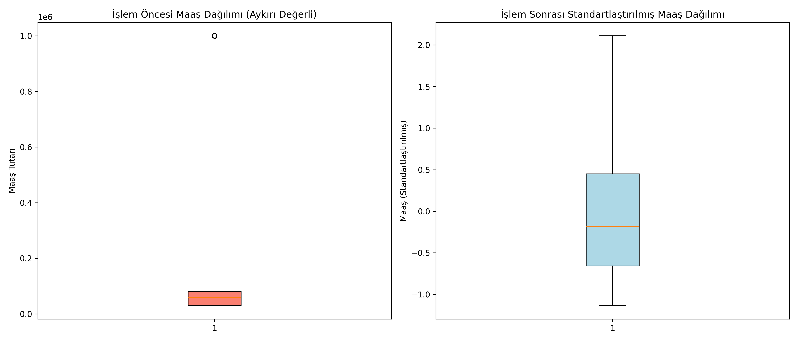

# 10 - Feature Engineering (Öznitelik Mühendisliği)

Bu çalışma, makine öğrenmesi modellerine ham verileri beslemeden önce, verilerin kalitesini artırmak ve algoritmaların öğrenebileceği en zengin öznitelik uzayını kurgulamak amacıyla hazırlanmıştır. Çalışmada, gerçek hayat verilerindeki yaygın sorunları barındıran yapay bir personel veri kümesi temizlenmiş ve dönüştürülmüştür.

---

## Öznitelik Mühendisliğinin Önemi

Yazılım dünyasındaki **"Garbage In, Garbage Out"** (Çöp Girdi, Çöp Çıktı) ilkesi yapay zekada da geçerlidir. Dünyanın en güçlü algoritmasını (örn: XGBoost) dahi kullansanız, modele kirli, ölçeklenmemiş veya anlamsız ham veriler verirseniz elde edeceğiniz sonuç başarısız olacaktır. Öznitelik mühendisliği, modellerin doğrusal veya doğrusal olmayan kalıpları çok daha kolay yakalamasını sağlar.

---

## Uygulanan Dönüşüm Adımları

Projedeki boru hattında (pipeline) sırasıyla şu kilit teknikler uygulanmıştır:

### Adım 1: Eksik Değer Doldurma (Imputation)
Verideki boşluklar (NaN) model eğitimini engeller.
- **Sayısal Kolonlar (Yaş, Maaş vb.):** Aykırı değerlerin (outliers) bozucu etkisine karşı dirençli olan **Medyan (Ortanca Değer)** ile doldurulmuştur.
- **Kategorik Kolonlar (Departman vb.):** En sık tekrar eden değer olan **Mod** ile tamamlanmıştır.

### Adım 2: Aykırı Değer Sıkıştırma (IQR & Winsorization)
Maaş kolonundaki `999999` gibi veri girişi hataları veya aşırı uç değerler modelleri saptırır.
- **IQR (Interquartile Range) Yöntemi** kullanılarak alt ve üst limitler belirlenmiştir:
  $$IQR = Q3 - Q1$$
  $$\text{Üst Sınır} = Q3 + 1.5 \times IQR$$
- Bu sınırların dışındaki uç değerler, limit sınırlarına bükülmüştür (`np.clip`).

### Adım 3: Kategorik Kodlama (Categorical Encoding)
Modeller metin verilerini doğrudan çarpamaz veya toplayamaz. Sayısal matrislere çevrilmeleri gerekir.
- **Ordinal Encoding (Dereceli):** `education_level` (High School, Bachelor, Master, PhD) hiyerarşik bir sıralamaya sahip olduğu için sırasıyla $0, 1, 2, 3$ olarak kodlanmıştır.
- **One-Hot Encoding (Derecesiz):** `department` (IT, Sales, HR) arasında büyüklük ilişkisi olmadığı için kukla değişkenlere (dummy variables) ayrılmıştır. Çoklu doğrusallığı ve "Kukla Değişken Tuzağı"nı önlemek için ilk kolon düşürülmüştür (`drop='first'`).

### Adım 4: Etkileşim ve Yeni Öznitelik Üretimi (Feature Creation)
Modellere ham veride doğrudan bulunmayan ancak kuralları kolaylaştıracak kombinasyonlar sunulur.
- **salary_per_experience:** Yıl bazlı tecrübe başına düşen maaş oranı hesaplanmıştır.
- **is_senior:** Yaşı ve tecrübesi belirli bir eşiğin üzerinde olan kıdemli personeller için $1$ veya $0$ bayrağı (flag) atanmıştır.

### Adım 5: Standartlaştırma (Feature Scaling)
Farklı ölçekteki sayısal kolonlar (Yaş $[20-50]$, Maaş $[30k-80k]$) z-skoru formülü ile aynı aralığa getirilmiştir:

$$X_{scaled} = \frac{X - \mu}{\sigma}$$

---
## Görsel Sonuç
Betik çalıştırıldıktan sonra kaydedilen `feature_engineering_transformation.png` görselinde öznitelik mühendisliğinin gücü açıkça görülmektedir:


---
## Dosya Yapısı

```text
10-feature-engineering/
├── README.md                           # Çalışma dökümantasyonu
├── requirements.txt                    # Bu klasöre özel kütüphaneler
├── feature_engineering_pipeline.py     # Öznitelik dönüşüm kodu
└── feature_engineering_transformation.png # Öncesi/Sonrası maaş dağılımı grafiği