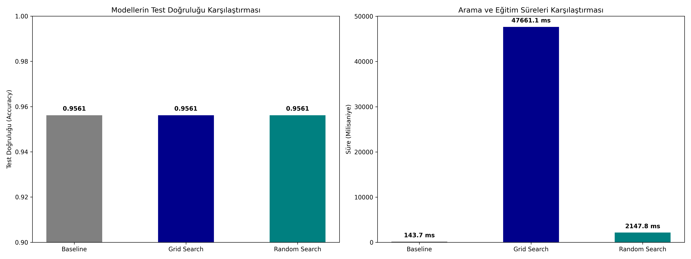

# 11 - Hyperparameter Tuning (Hiperparametre Optimizasyonu)

Bu çalışma, makine öğrenmesi modellerinin performans sınırlarını belirlemek ve aşırı öğrenme (overfitting) ile eksik öğrenme (underfitting) dengesini en uygun noktaya getirmek amacıyla hazırlanmıştır. Projede bir Rastgele Orman (Random Forest) modelinin hiperparametreleri **Grid Search** ve **Random Search** yöntemleri kullanılarak optimize edilmiştir.

---

## Parametre (Parameter) ve Hiperparametre (Hyperparameter) Farkı

Makine öğrenmesinde bu iki terim sıklıkla karıştırılır ancak sorumluluk alanları tamamen farklıdır:

1. **Parametre (Parameter):** Modelin eğitim esnasında **veriden doğrudan öğrendiği** içsel değerlerdir. Kullanıcı tarafından elle müdahale edilmez.
   - *Örnekler:* Doğrusal regresyondaki katsayılar ($\beta_i$), yapay sinir ağlarındaki ağırlıklar (weights) ve sapmalar (biases).
2. **Hiperparametre (Hyperparameter):** Modelin öğrenme süreci başlamadan önce **kullanıcı tarafından dışarıdan belirlenen** yapılandırma ayarlarıdır. Model bunları kendi kendine öğrenemez.
   - *Örnekler:* Rastgele Ormandaki ağaç sayısı (`n_estimators`), KNN'deki komşu sayısı ($K$), Karar Ağaçlarındaki maksimum derinlik (`max_depth`), Gradyan artırmadaki öğrenme oranı (`learning_rate`).

---

## Optimizasyon Yöntemleri

En iyi hiperparametre setini bulmak için yaygın olarak kullanılan iki yöntem bu çalışmada karşılaştırılmıştır:

### 1. Grid Search (Izgara Araması)
Kullanıcının belirlediği parametre değerlerinin **tüm olası kombinasyonlarını (kartelyen çarpımını)** tek tek ve sistematik olarak dener (Brute Force).
- **Avantajı:** Belirtilen parametre uzayındaki en kusursuz kombinasyonu bulmayı garanti eder.
- **Dezavantajı:** Parametre sayısı arttıkça kombinasyon sayısı katlanarak artar. Çok yüksek işlem gücü gerektirir ve çok yavaştır.

### 2. Random Search (Rastgele Arama)
Belirlenen parametre uzayındaki kombinasyonların tamamını denemek yerine, **rastgele seçilen belirli sayıda ($N$ iterasyon)** kombinasyonu örnekler.
- **Avantajı:** Grid Search'e kıyasla çok daha az kombinasyon denediği için inanılmaz derecede hızlıdır. Olasılık teorisine göre, geniş aramalarda Grid Search ile neredeyse aynı doğruluktaki en iyi parametreyi çok daha kısa sürede bulabilir.
- **Dezavantajı:** Rastgelelikten ötürü şans eseri en kusursuz tepe noktasını ıskalayabilir (ancak pratikte sağladığı zaman tasarrufu bu riski fazlasıyla karşılar).

---

## Görsel Sonuç
Betik çalıştırıldıktan sonra kaydedilen `hyperparameter_tuning_comparison.png` görselinde hiperparametre optimizasyonunun operasyonel farkı gözlemlenecektir:


---
## Dosya Yapısı

```text
11-hyperparameter-tuning/
├── README.md                           # Çalışma dökümantasyonu
├── requirements.txt                    # Bu klasöre özel kütüphaneler
├── grid_search_tuning.py               # Grid ve Random Search kodu
└── hyperparameter_tuning_comparison.png# Süre ve Doğruluk kıyaslama grafiği