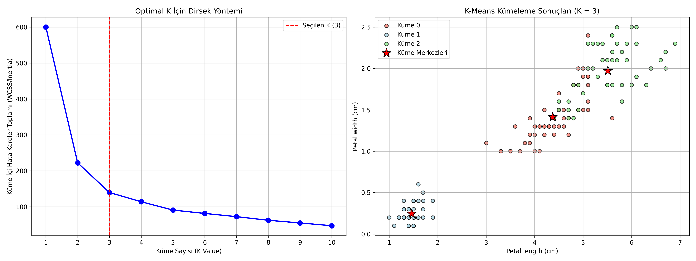

# 01 - K-Means Clustering (K-Ortalama Kümeleme)

Bu çalışma, gözetimsiz makine öğrenmesinde (unsupervised learning) veri noktalarını benzerliklerine göre gruplamak amacıyla en sık tercih edilen mesafe tabanlı **K-Means (K-Ortalama)** algoritmasını uygulamak amacıyla hazırlanmıştır. Projede Iris çiçek veri kümesinin etiketleri tamamen göz ardı edilerek, sadece fiziksel ölçümleri üzerinden kümeleme gerçekleştirilmiştir.

---

## Gözetimsiz Öğrenme (Unsupervised Learning) Nedir?

Gözetimli öğrenmenin aksine, gözetimsiz öğrenmede veri setinde bir hedef değişken veya etiket ($y$) **bulunmaz**.
- Model, eğitim esnasında neyin doğru neyin yanlış olduğunu gösteren bir "öğretici" olmadan çalışır.
- Amaç, verinin kendi geometrik dağılımından, yoğunluğundan ve benzerliklerinden yola çıkarak gizli yapıları (alt grupları, anomalileri) ortaya çıkarmaktır.

---

## K-Means Algoritmasının Matematiksel Mantığı

K-Means, verileri birbirine benzeyen $K$ adet kümeye ayırmayı hedefler. Algoritma, **Küme İçi Hata Kareler Toplamını (Within-Cluster Sum of Squares - WCSS / Inertia)** minimize edecek şekilde çalışır:

$$J = \sum_{j=1}^{K} \sum_{i \in S_j} \|x_i - \mu_j\|^2$$

Burada:
- $K$: Küme sayısı.
- $S_j$: $j$. kümedeki örneklerin kümesi.
- $x_i$: Küme içerisindeki bir veri noktası.
- $\mu_j$: $j$. kümenin merkezi (centroid - ortalama vektör).
- $\|x_i - \mu_j\|^2$: Noktanın merkeze olan Öklid mesafesinin karesi.

### Algoritmanın Adımları:
1. **Başlatma (Initialization):** Rastgele $K$ adet merkez noktası (centroids) seçilir (Sektör standardı olan `K-means++` yaklaşımı, başlangıç merkezlerinin birbirine çok yakın seçilmesini önleyerek algoritmanın daha hızlı yakınsamasını sağlar).
2. **Atama (Assignment):** Her veri noktası, kendisine en yakın olan küme merkezine atanır.
3. **Güncelleme (Update):** Her kümenin yeni merkezi, o kümeye atanan tüm noktaların ortalaması alınarak yeniden hesaplanır.
4. **Yineleme (Iteration):** Merkezlerin yerleri değişmeyene veya maksimum adım sayısına ulaşılana kadar 2. ve 3. adımlar tekrarlanır.

---

## Doğru Küme Sayısı ($K$) Nasıl Seçilir?

K-Means algoritmasında küme sayısı kullanıcı tarafından el ile girilmelidir. En doğru $K$ değerini seçmek için iki popüler teknik kullanılır:

### 1. Dirsek Yöntemi (Elbow Method)
Küme sayısı ($K$) arttıkça, noktalar merkezlere yaklaşacağı için hata kareler toplamı (Inertia/WCSS) kaçınılmaz olarak sıfıra doğru düşer.
- Ancak belirli bir $K$ değerinden sonra bu düşüş hızı yavaşlar ve grafikte bir kırılma ("dirsek" veya "diz" benzeri bir bükülme) oluşur.
- Bu kırılma noktası, model karmaşıklığı ile hata oranının en dengeli olduğu **optimal küme sayısı** olarak kabul edilir.

### 2. Silhouette Analizi
Her bir veri noktasının kendi kümesindeki noktalara olan yakınlığı ile en yakın komşu kümedeki noktalara olan uzaklığını kıyaslar.
- Değeri $[-1, +1]$ aralığındadır.
- $+1$'e yakın değerler, kümelemenin çok başarılı ve sınırların net olduğunu; negatif değerler ise noktaların yanlış kümelere atandığını gösterir.

---

## Neden Özellik Ölçeklendirme (Feature Scaling) Zorunludur?

K-Means tamamen Öklid mesafesi hesaplamasına dayalı bir algoritmadır. Özniteliklerin farklı aralıklarda değer alması mesafeyi tamamen bütçeleyeceği için veriye `StandardScaler` uygulayarak tüm öznitelikleri eşit ağırlığa getirmek **kesinlikle zorunludur**.

---

## Görsel Sonuç
Betik çalıştırıldıktan sonra kaydedilen `kmeans_results.png` görselinde şunları analiz edebilirsiniz:


---
## Dosya Yapısı

```text
01-kmeans/
├── README.md                      # Çalışma dökümantasyonu
├── requirements.txt               # Bu klasöre özel kütüphaneler
├── kmeans_clustering_iris.py      # K-Means kümeleme kodu
└── kmeans_results.png             # Dirsek yöntemi ve nihai kümeleme grafiği