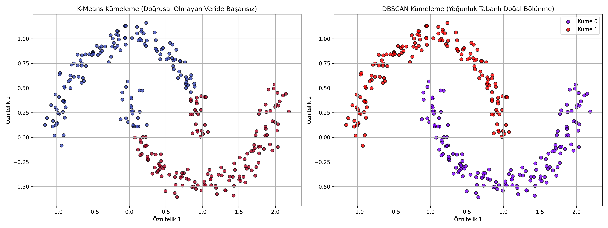

# 02 - DBSCAN (Yoğunluk Tabanlı Mekansal Kümeleme)

Bu çalışma, makine öğrenmesinde yoğunluk tabanlı kümeleme felsefesiyle çalışan **DBSCAN (Density-Based Spatial Clustering of Applications with Noise)** algoritmasını incelemek amacıyla hazırlanmıştır. Projede hilal şeklinde doğrusal olmayan (non-linear) karmaşık bir veri kümesi üzerinde K-Means ve DBSCAN algoritmalarının performans farkları karşılaştırılmıştır.

---

## Neden K-Means Yerine DBSCAN?

K-Means ve hiyerarşik kümeleme gibi algoritmalar, veri kümelerinin küresel (dairesel) dağılımlara sahip olduğunu varsayar. Ancak gerçek hayatta veriler kıvrımlı, iç içe geçmiş veya organik şekillerde bulunabilir.
- **K-Means Sınırları:** Veriyi merkez noktalarına olan uzaklıklara göre düz doğrularla böler. Bu yüzden hilal şeklindeki iki grubu birbirinden ayıramaz.
- **DBSCAN Gücü:** Geometrik şekilden bağımsız olarak, sadece veri noktalarının sıklaştığı (yoğun olduğu) bölgeleri takip ederek doğal küme sınırları çizer.

---

## DBSCAN Algoritmasının Çalışma Prensipleri

DBSCAN, veri noktalarını yoğunluklarına göre 3 farklı kategoriye ayırır:

### 1. Temel Tanımlar
- **$\epsilon$ (Epsilon) Komşuluğu:** Bir veri noktasının etrafındaki $eps$ yarıçaplı dairesel alan.
- **Minimum Nokta Sayısı ($MinPts$ / `min_samples`):** Bir bölgenin "yoğun" kabul edilebilmesi için $\epsilon$-komşuluğunda bulunması gereken en az nokta sayısı.

### 2. Nokta Türleri
- **Çekirdek Nokta (Core Point):** $\epsilon$-komşuluğu içerisinde en az $MinPts$ kadar nokta barındıran kilit noktalardır. Kümelerin çekirdeğini oluştururlar.
- **Sınır Nokta (Border Point):** Kendisi bir çekirdek nokta olmasa da, bir çekirdek noktanın $\epsilon$-komşuluğu içinde yer alan noktalardır. Kümelerin uç sınırlarını oluştururlar.
- **Gürültü / Aykırı Değer (Noise Point):** Ne bir çekirdek noktadır ne de herhangi bir çekirdek noktanın komşuluğuna girer. Kümelerin tamamen dışında kalırlar (DBSCAN bunları otomatik olarak $-1$ etiketiyle eler).

---

## Kilit Hiperparametreler ve Seçimi

DBSCAN küme sayısını ($K$) kendiliğinden bulsa da, iki hassas hiperparametreye ihtiyaç duyar:

1. **`eps` (Epsilon):** Çok küçük seçilirse veri noktalarının büyük kısmı gürültü (noise) olarak elenir ve kümeler parçalanır. Çok büyük seçilirse farklı kümeler birleşerek tek bir dev küme haline gelir.
2. **`min_samples`:** Yoğunluk eşiğidir. Gürültülü ve kirli veri kümelerinde bu değerin artırılması modelin aykırı değerlere karşı direncini artırır. Genellikle minimum $4$ veya daha yüksek ($2 \times \text{Boyut}$) seçilmesi önerilir.

---
## Görsel Sonuç
Betik çalıştırıldıktan sonra kaydedilen `dbscan_vs_kmeans.png` görselinde iki model arasındaki fark net bir şekilde gözlemlenecektir:


---
## Dosya Yapısı

```text
02-dbscan/
├── README.md                      # Çalışma dökümantasyonu
├── requirements.txt               # Bu klasöre özel kütüphaneler
├── dbscan_clustering_moons.py     # Karşılaştırmalı DBSCAN kodu
└── dbscan_vs_kmeans.png           # K-Means ve DBSCAN karşılaştırma grafiği