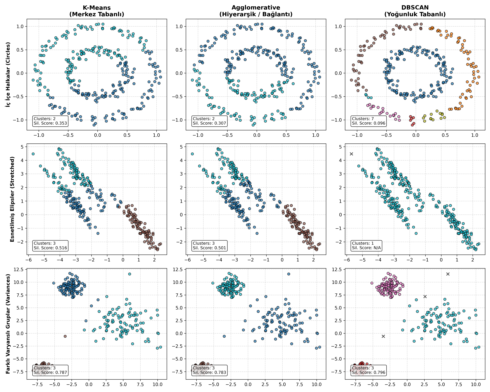

# 03 - Clustering Algorithms Comparison (Kümeleme Karşılaştırması)

Bu çalışma, gözetimsiz öğrenmedeki (unsupervised learning) kümeleme problemlerini çözmek için kullanılan üç farklı felsefedeki algoritmayı (**K-Means**, **Agglomerative Clustering** ve **DBSCAN**) farklı geometrilere sahip yapay veri kümeleri üzerinde eş zamanlı ve karşılaştırmalı olarak analiz etmek amacıyla hazırlanmıştır.

---

## Kümeleme Algoritmalarının Yapısal Farkları

| Algoritma | Çalışma Felsefesi | Küme Sayısı ($K$) Tanımı | Geometrik Sınırı | Gürültü (Aykırı) Hassasiyeti |
| :--- | :--- | :--- | :--- | :--- |
| **K-Means** | **Merkez Tabanlı (Centroid-based):** Her noktayı en yakın merkeze (ortalama değere) atar. | Kullanıcı el ile tanımlamalıdır. | Sadece dairesel/küresel (spherical) kümeleri yakalayabilir. | Aşırı hassastır; aykırı değerler merkezleri kaydırır. |
| **Agglomerative** | **Bağlantı/Hiyerarşi Tabanlı (Connectivity-based):** Noktaları en yakından en uzağa doğru ağaç yapısıyla (dendrogram) birleştirir. | Kullanıcı el ile tanımlamalıdır. | Linkage (bağlantı) kriterine göre (örn: Ward) doğrusal olmayan yapıları kısmen yakalayabilir. | Hassastır; aykırı değerleri bağımsız tekil kümeler yapma eğilimindedir. |
| **DBSCAN** | **Yoğunluk Tabanlı (Density-based):** Noktaların sıklaştığı bölgeleri takip ederek organik sınırlar çizer. | Kendiliğinden tespit eder. | Doğrusal olmayan her türlü karmaşık şekli (hilal, halka vb.) ayırabilir. | Hassas değildir; aykırı değerleri otomatik olarak tespit edip eler. |

---

## Test Edilen Geometrik Zorluklar

Karşılaştırma matrisinde modellerin sınırlarını test etmek amacıyla üç farklı yapay senaryo kurgulanmıştır:

### 1. İç İçe Halkalar (Circles)
Doğrusal olmayan, dairesel sınırları olmayan ve merkezleri üst üste binen bir yapıdır.
- **K-Means & Agglomerative:** İki halkanın merkezleri aynı noktaya çok yakın olduğu için bu yapıyı dikey veya yatay olarak ikiye bölerek başarısız olurlar.
- **DBSCAN:** Yoğunluk zincirini takip ettiği için içteki ve dıştaki halkaları kusursuz bir şekilde ayırır.

### 2. Esnetilmiş Eğik Elipsler (Stretched)
Doğrusal ancak birbirine yakın eğik elipslerden oluşur.
- **K-Means:** Veriler arasındaki mesafeyi dikkate alırken yönü dikkate almadığı için elipslerin uç kısımlarını yanlış kümelere atar.
- **DBSCAN & Agglomerative (Ward):** Elipslerin uzandığı doğrultudaki yoğunluk ve bağlantı yapısını başarılı bir şekilde kavrayabilirler.

### 3. Farklı Varyanslara Sahip Gruplar (Variances)
Dairesel ancak yoğunlukları ve yayılımları birbirinden radikal düzeyde farklı olan standart gruplardır.
- **K-Means & Agglomerative:** Küresel yapıları çok rahat sınıflandırırlar.
- **DBSCAN:** Yoğunluklar çok farklı olduğunda, seyrek olan kümeyi tamamen gürültü (noise) olarak algılayabilir veya parametre ayarı (`eps`) çok hassaslaşır.

---

## Görsel Sonuç
Bu matris, gerçek dünya projelerinde verinizin şekline ve dağılımına bakarak hangi algoritmayı seçmeniz gerektiğine dair mükemmel bir kılavuz görevi görür.


---

## Dosya Yapısı

```text
03-clustering-comparison/
├── README.md                           # Çalışma dökümantasyonu
├── requirements.txt                    # Bu klasöre özel kütüphaneler
├── clustering_algorithms_comparison.py # Karşılaştırmalı test kodu
└── clustering_comparison_grid.png      # 3x3 karşılaştırma matris grafiği