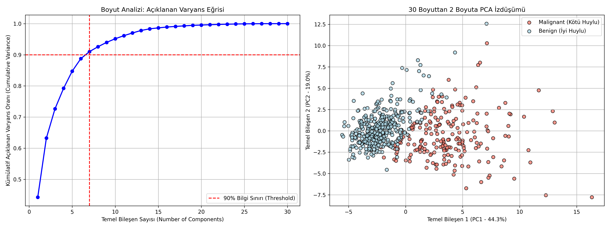

# 04 - Principal Component Analysis (Temel Bileşen Analizi)

Bu çalışma, gözetimsiz boyut azaltma (dimensionality reduction) yöntemlerinin en temel ve yaygın doğrusal tekniği olan **PCA (Principal Component Analysis - Temel Bileşen Analizi)** algoritmasını uygulamak amacıyla hazırlanmıştır. Projede 30 boyutlu karmaşık göğüs kanseri veri seti, bilgi kaybı minimumda tutularak 2 boyuta indirgenmiş ve sınıfların ayrışma gücü görselleştirilmiştir.

---

## Boyut Azaltmanın Gerekliliği: "Boyutların Laneti" (Curse of Dimensionality)

Veri setlerindeki öznitelik (sütun) sayısının aşırı fazla olması, modellerimiz için çeşitli zorluklar yaratır:
1. **Aşırı Öğrenme (Overfitting):** Boyut arttıkça modelin verideki gürültüyü ezberleme olasılığı artar.
2. **Hesaplama Yükü:** Eğitim süreleri ve bellek (RAM) tüketimi geometrik olarak artar.
3. **Görselleştirme İmkansızlığı:** İnsan beyni 3 boyuttan büyük uzayları doğrudan görselleştiremez.

Boyut azaltma teknikleri, veri setindeki gereksiz (korelasyonu yüksek veya bilgi değeri düşük) boyutları eleyerek veriyi sadeleştirir.

---

## PCA Algoritmasının Matematiksel Mantığı

PCA, veriyi birbirine dik (orthogonal - yani korelasyonu sıfır olan) ve verideki **en yüksek varyansı (bilgiyi)** temsil eden yeni yapay eksenlere (**Temel Bileşenler - Principal Components**) izdüşürür.

### Adım Adım Çalışma Mantığı:
1. **Merkezleme (Zero-centering):** Verinin her kolonunun ortalaması sıfır olacak şekilde merkezlenir.
2. **Kovaryans Matrisi Hesaplama:** Değişkenlerin birbiriyle olan ilişkilerini gösteren Kovaryans Matrisi ($\Sigma$) hesaplanır:
   $$\Sigma = \frac{1}{n-1} X^T X$$
3. **Özdeğerler ve Özvektörler (Eigenvalues & Eigenvectors):** Kovaryans matrisinin özvektörleri ve özdeğerleri bulunur:
   $$\Sigma v = \lambda v$$
   - **Özvektörler ($v$):** Yeni eksenlerin (Temel Bileşenlerin) doğrultusunu gösterir.
   - **Özdeğerler ($\lambda$):** O bileşenin verideki varyansın (bilginin) ne kadarını koruduğunu gösterir.
4. **Sıralama ve İzdüşüm:** Özdeğerler büyükten küçüğe sıralanır. En büyük değere sahip ilk $k$ adet özvektör seçilir ve ham veri bu yeni düzleme çarpılarak yansıtılır.

---

## Neden Özellik Ölçeklendirme (Feature Scaling) Zorunludur?

PCA, verideki varyans miktarını doğrudan maksimize etmeye odaklanır.
- Örneğin, bir değişkenin aralığı $[1, 10000]$ iken diğerinin aralığı $[0.1, 0.9]$ ise, varyans hesaplamasında büyük ölçekli olan değişken varyansın neredeyse tamamını tek başına kaplıyor gibi görünür.
- PCA bu hataya düşerek sadece büyük ölçekli değişkene odaklanan bir projeksiyon çizer.
- Bu saptırmayı önlemek için veriye `StandardScaler` uygulayarak tüm değişkenlerin ortalamasını $0$, standart sapmasını $1$ yapmak **tamamen zorunludur**.

---

## Görsel Sonuç
Betik çalıştıktan sonra kaydedilen `pca_results.png` görselinde iki önemli grafiği analiz edebilirsiniz:


---

## Dosya Yapısı

```text
04-pca/
├── README.md                      # Çalışma dökümantasyonu
├── requirements.txt               # Bu klasöre özel kütüphaneler
├── pca_dimension_reduction.py     # PCA boyut azaltma kodu
└── pca_results.png                # Varyans analizi ve 2B izdüşüm grafiği