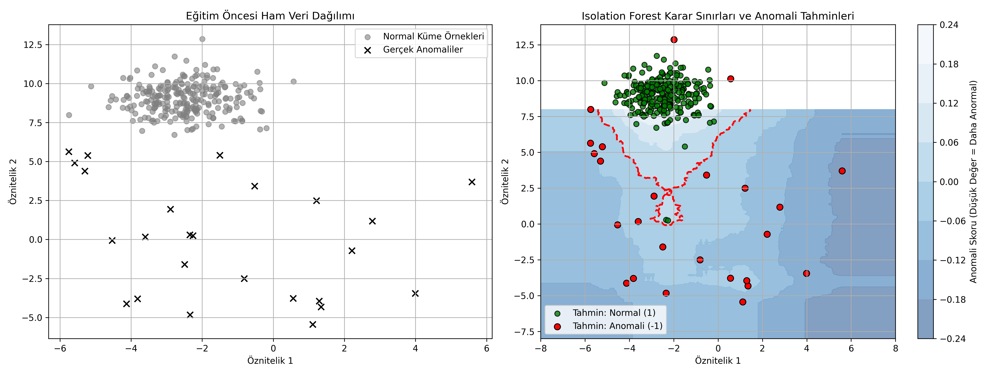

# 05 - Isolation Forest (İzolasyon Ormanı Anomali Tespiti)

Bu çalışma, gözetimsiz öğrenmenin en önemli pratiklerinden biri olan **Anomali Tespiti (Anomaly / Outlier Detection)** konusunu ele almak ve bu alanda en başarılı sonuçları veren **İzolasyon Ormanı (Isolation Forest)** algoritmasını uygulamak amacıyla hazırlanmıştır. Projede yapay olarak üretilmiş bir veri kümesi üzerinde, kümenin dışına saçılmış anomali noktalarının tespiti gerçekleştirilmiştir.

---

## Anomali Tespiti ve İzolasyon Felsefesi

Geleneksel anomali tespit yöntemleri (örn: One-Class SVM veya Kümeleme modelleri), önce "normal" verilerin nasıl göründüğünü (yoğunluğunu, sınırlarını) öğrenmeye çalışır. Bu yaklaşıma **normal profilleme** denir.
- Ancak normali profillemek zordur ve yüksek işlem gücü gerektirir.
- **İzolasyon Ormanı (Isolation Forest)** ise bu mantığı tersine çevirir. Algoritma şu iki temel kabule dayanır:
  1. Anomaliler veri kümesinde **çok az sayıdadır** (few).
  2. Anomaliler normal verilerden **radikal biçimde farklı öznitelik değerlerine sahiptir** (different).

Bu iki özellik, anomalilerin normal verilere kıyasla **çok daha kolay izole edilebileceğini (ayrılabileceğini)** gösterir.

---

## Algoritmanın Çalışma Mekanizması

İzolasyon Ormanı, Random Forest gibi çok sayıda bağımsız karar ağacından (**İzolasyon Ağaçları - iTrees**) oluşur. 

1. **Rastgele Dallanma:** Her bir ağaç oluşturulurken, rastgele bir öznitelik seçilir ve bu özniteliğin minimum ile maksimum değerleri arasında rastgele bir bölünme noktası (split) belirlenir.
2. **Yol Uzunluğu (Path Length - $h(x)$):** Dallanma işlemi, her bir veri noktası tek bir yaprakta yalnız kalana kadar devam eder.
   - **Anomaliler (Kırmızı Noktalar):** Normallere göre çok uzakta ve farklı oldukları için, ağaçlarda sadece birkaç rastgele bölünmeyle hemen izole edilirler. Yani kök dizine çok yakındırlar ve yol uzunlukları ($h(x)$) **kısadır**.
   - **Normaller (Yeşil Noktalar):** Yoğun bir küme halinde bir arada bulundukları için, onları tek tek izole etmek çok zordur. Birçok bölünme yapılması gerekir. Bu yüzden yol uzunlukları ($h(x)$) **uzundur**.

### Anomali Skoru Formülü ($s$)
Bir $x$ örneğinin anomali skoru, $n$ adet örnek barındıran bir ağaç kümesindeki ortalama yol uzunluğu $E(h(x))$ üzerinden hesaplanır:

$$s(x, n) = 2^{-\frac{E(h(x))}{c(n)}}$$

*Burada $c(n)$, başarısız aramalardaki ortalama yol uzunluğunu temsil eden normalize edici bir sabittir.*
- **$s \approx 1$ (Kısa Yol):** Örnek çok hızlı izole edilmiştir. Kesinlikle **anomalidir**.
- **$s < 0.5$ (Uzun Yol):** Örnek ağacın derinliklerindedir. Güvenle **normaldir**.

---

## İzolasyon Ormanının Yapısal Avantajları

- **Ölçeklendirme Bağımsızlığı:** Tıpkı Random Forest gibi tamamen ağaç bölme kurallarına dayandığı için veri noktaları arasındaki mesafeyi doğrudan hesaplamaz. Bu yüzden özellik ölçeklendirme (`StandardScaler`) **gerekli değildir**.
- **Doğrusal Zaman Karmaşıklığı:** Zaman karmaşıklığı $O(n)$ düzeyindedir. Mesafe tabanlı modeller gibi her noktanın birbirine olan mesafesini tek tek hesaplamadığı için devasa boyutlu veri kümelerinde son derece hızlı çalışır.

---
## Görsel Sonuç
Betik çalıştırıldıktan sonra kaydedilen `isolation_forest_results.png` görselinin sağ tarafındaki grafiği inceleyebilirsiniz:


---

## Dosya Yapısı

```text
05-isolation-forest/
├── README.md                           # Çalışma dökümantasyonu
├── requirements.txt                    # Bu klasöre özel kütüphaneler
├── isolation_forest_anomaly_detection.py # Anomali tespit kodu
└── isolation_forest_results.png        # Karar sınırları ve anomali ısı haritası