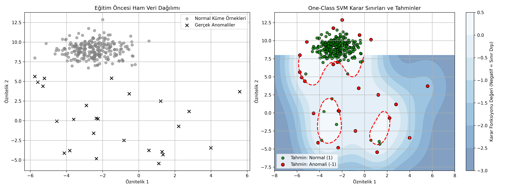

# 06 - One-Class SVM (Tek Sınıflı Destek Vektör Makineleri)

Bu çalışma, gözetimsiz anomali tespiti ve yenilik tespiti (novelty detection) problemlerini çözmek amacıyla geliştirilen, SVM tabanlı **One-Class SVM (Tek Sınıflı Destek Vektör Makineleri)** algoritmasını uygulamak amacıyla hazırlanmıştır. Projede, dairesel normal veri kümesinin dışına yayılmış anomali noktalarının tespiti geometrik sınır çizimi yöntemiyle gerçekleştirilmiştir.

---

## Matematiksel ve Teorik Arka Plan

Geleneksel SVM, iki farklı sınıfı birbirinden en geniş marjla ayıran bir sınır çizer. **One-Class SVM** ise sadece tek bir sınıfın (normal verilerin) bulunduğu durumlarda çalışır.

### 1. Orijinden Ayırma ve Maksimum Marj
Algoritma, normal veri noktalarını doğrusal olmayan bir dönüşüm (RBF Kernel) ile yüksek boyutlu bir özellik uzayına taşır.
- Bu yüksek boyutlu uzayda, normal verileri **koordinat başlangıç noktasından (orijinden)** maksimum mesafe ile ayıran bir hiperdüzlem (karar sınırı) çizer.
- Orijin, "anomali / boşluk" sınıfını temsil ederken; hiperdüzlemin diğer tarafındaki bölge ise "normal veri" bölgesini temsil eder.

$$\min_{w, \xi, \rho} \frac{1}{2} \|w\|^2 + \frac{1}{\nu n} \sum_{i=1}^{n} \xi_i - \rho$$

$$\text{subject to } (w \cdot \Phi(x_i)) \geq \rho - \xi_i, \quad \xi_i \geq 0$$

### 2. $\nu$ (Nu) Parametresi
Modeldeki en kilit hiperparametredir. İki amaca hizmet eder:
- Eğitim setindeki **izin verilen maksimum hata oranı** (yani anomali/aykırı değer oranı limitidir).
- Modelin karar sınırını çizerken kullanacağı minimum destek vektörü oranını belirler.

---

## One-Class SVM ve İzolasyon Ormanı Karşılaştırması

İki popüler anomali tespiti algoritmasının pratik ve yapısal farkları şunlardır:

| Karşılaştırma Kriteri | Isolation Forest | One-Class SVM |
| :--- | :--- | :--- |
| **Algoritma Ailesi** | Ağaç Tabanlı (Ensemble/Tree) | Geometrik ve Çekirdek Tabanlı (Kernel-based) |
| **Çalışma Mantığı** | Hızlı bölünmelerle anomalileri izole eder. | Verinin etrafına sıkı bir karar sınırı (küre/zarf) çizer. |
| **Özellik Ölçeklendirme** | **Gerekli Değildir.** | **Kesinlikle Zorunludur** (Aksi halde mesafeler bozulur). |
| **Yüksek Boyut Performansı** | Çok iyi ölçeklenir; gürültüye dayanıklıdır. | Boyut çok arttığında karar sınırları hassaslaşabilir ve yavaşlayabilir. |
| **Hassasiyet** | Genel global anomalileri çok iyi yakalar. | Verinin ince sınır geometrisini ve lokal anomalileri yakalamada başarılıdır. |

---
## Görsel Sonuç
Betik çalıştıktan sonra kaydedilen `one_class_svm_results.png` görselinin sağ tarafındaki grafiği inceleyebilirsiniz:


---

## Dosya Yapısı

```text
06-one-class-svm/
├── README.md                           # Çalışma dökümantasyonu
├── requirements.txt                    # Bu klasöre özel kütüphaneler
├── one_class_svm_anomaly_detection.py  # One-Class SVM anomali tespit kodu
└── one_class_svm_results.png           # Karar sınırları ve anomali ısı haritası